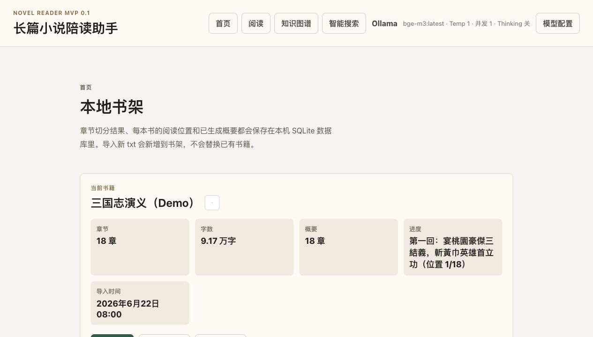
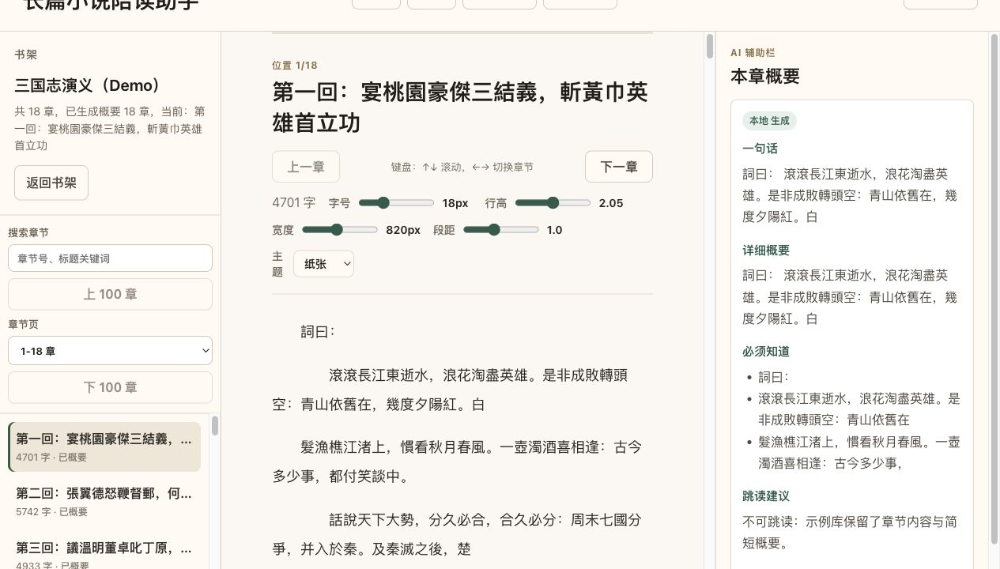
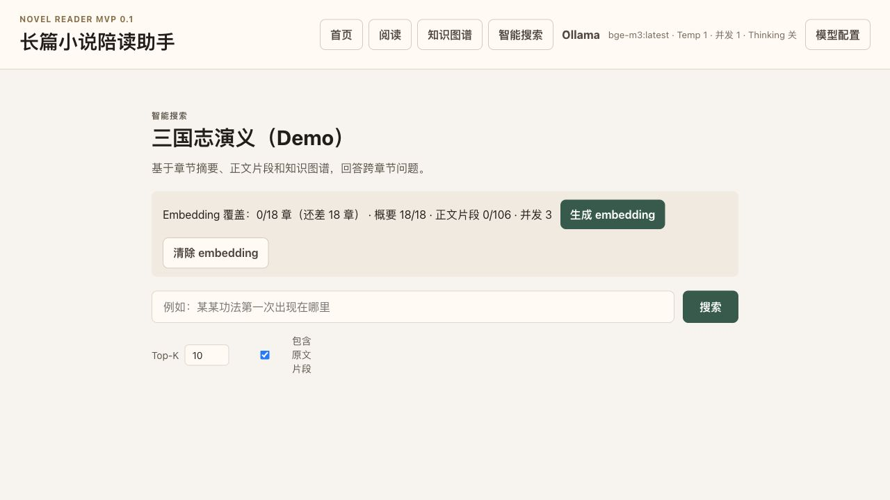

# Novel Reader Assistant

[English](README.en.md) | [中文](README.md)

Offline-first novel reader with EPUB import, RAG search, knowledge graph extraction, and an Android companion app.


Novel Reader Assistant is built for long web novels where remembering every character, item, faction, and plot thread becomes part of the reading work. It keeps your library in a local SQLite database, lets local or OpenAI-compatible models summarize chapters, builds a searchable story knowledge graph, and syncs PC-generated book packages to Android for offline reading.

## Real UI Preview

These screenshots come from an isolated demo data directory seeded with public-domain texts from *Romance of the Three Kingdoms* and *Journey to the West*. They do not use a personal reading library.





## Quick Demo

You can reach the core experience in about five minutes:

1. Start the app:

   ```bash
   npm install
   npm run dev
   ```

2. Open `http://127.0.0.1:5173/` and import a `.txt` or `.epub` novel.
3. Go to the reader first to verify chapter splitting, navigation, reading theme, and progress restore.
4. Open `Model Config` and set up either Ollama or an OpenAI-compatible endpoint.
5. Generate summaries for a few chapters, then open `Smart Search`, create embeddings, and ask one cross-chapter question.
6. Open `Knowledge Graph`, scan the current chapter or a small range, and inspect entities, relations, and evidence search.

## Highlights

- **Local-first reading**: import `.txt` or `.epub`, split chapters, save reading progress, and keep data under `~/.novel_reader`.
- **RAG search for long stories**: create summary/body embeddings, retrieve relevant chapters, and generate grounded answers from local book context.
- **Knowledge graph extraction**: track characters, factions, items, skills, locations, beasts, events, and relations with evidence links.
- **Graph cleanup workflow**: review low-confidence entities, merge duplicates, split mistakes, replay saved JSON, and export JSON or GraphML.
- **Flexible model setup**: use Ollama or OpenAI-compatible endpoints for generation and embeddings, with separate validation and profiles.
- **Android companion app**: sync full book packages over LAN, then read chapters, summaries, and graph data offline on Android.
- **Offline batch scanner**: run summary and knowledge graph jobs outside the browser with resumable CLI workflows.

## Quick Start

```bash
npm install
npm run dev
```

This starts both the Vite frontend and the local database API. Open:

```text
http://127.0.0.1:5173/
```

The SQLite database is stored at:

```text
~/.novel_reader/novel_reader.sqlite
```

## What You Can Do

- Import UTF-8 / GB18030 `.txt` novels or `.epub` books by reading OPF spine and XHTML chapters.
- Generate single-chapter, current-page, or all-missing chapter summaries.
- Build and inspect a knowledge graph with filters, evidence search, graph visualization, and review queues.
- Run RAG search across chapter summaries, body chunks, and knowledge graph matches.
- Export or restore the full local SQLite database from the web UI.
- Build an Android debug APK from the `mobile-app` workspace.

## Documentation

- [Development Guide](docs/development.md)
- [开发文档（中文）](docs/development.zh-CN.md)
- [Backend API Reference](docs/backend-api.md)
- [Mobile API Contract](mobile-app/docs/api.md)
- [Android App Guide](mobile-app/docs/android.md)
- [Knowledge Graph Roadmap](docs/knowledge-graph-roadmap.md)
- [Current Progress](docs/current_progress.md) (Chinese)

## Android Mobile App

Start the PC API on a LAN-reachable address:

```bash
NOVEL_READER_API_HOST=0.0.0.0 npm run api
```

In the Android app, use the PC LAN URL, for example:

```text
http://192.168.x.x:5174
```

Build a debug APK from the mobile workspace:

```bash
cd mobile-app
npm install
npm run android:sync
cd android
JAVA_HOME=/opt/homebrew/opt/openjdk@21/libexec/openjdk.jdk/Contents/Home \
PATH="/opt/homebrew/opt/openjdk@21/bin:$PATH" \
ANDROID_HOME=/opt/homebrew/share/android-commandlinetools \
./gradlew assembleDebug
```

APK output:

```text
mobile-app/android/app/build/outputs/apk/debug/app-debug.apk
```

See [mobile-app/docs/android.md](mobile-app/docs/android.md) for Android build, LAN HTTP sync, and status-bar safe-area notes.

## Development

You can change the dev server port:

```bash
NOVEL_READER_PORT=5174 npm run dev
```

You can change the database location or API port:

```bash
NOVEL_READER_DATA_DIR=/path/to/data NOVEL_READER_API_PORT=6174 npm run dev
```

For LAN mobile sync, `NOVEL_READER_MOBILE_SYNC_TOKEN` can be set to require `Authorization: Bearer <token>` on `/api/mobile/*`.

## Reader Instance

To run a separate local reading instance without occupying the development port:

```bash
NOVEL_READER_PORT=6173 npm run reader:build
```

Open:

```text
http://127.0.0.1:6173/
```

You can also customize the host:

```bash
NOVEL_READER_HOST=0.0.0.0 NOVEL_READER_PORT=6173 npm run reader:build
```

## Build

```bash
npm run build
```

## Notes

This is currently a personal local web app. API keys are stored in the local SQLite database, so do not use this deployment model for a public multi-user service without adding a backend proxy, authentication, and secret management.
If you bind the API server to `0.0.0.0` for mobile sync, use it only on trusted LANs or set `NOVEL_READER_MOBILE_SYNC_TOKEN`.
