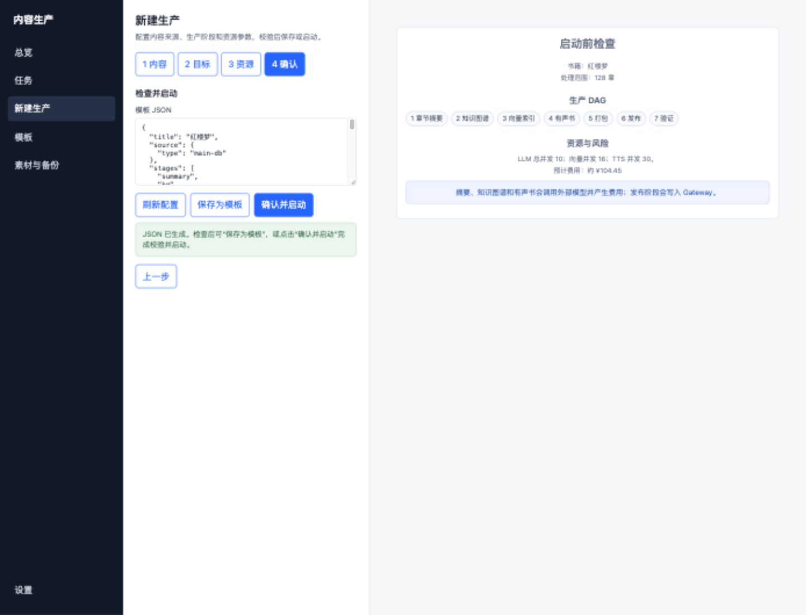
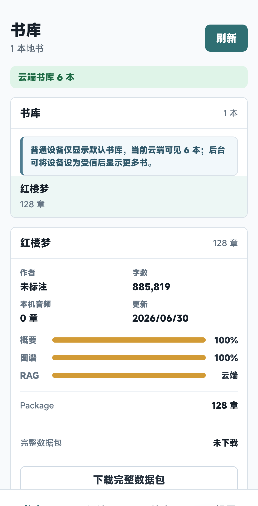
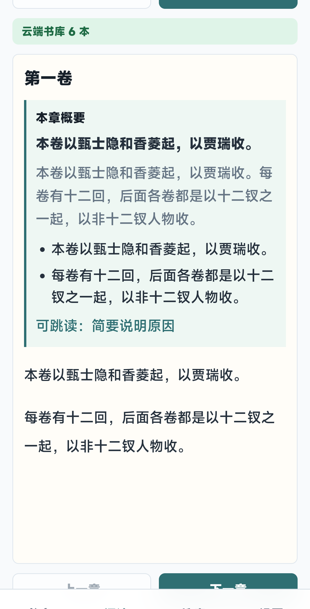
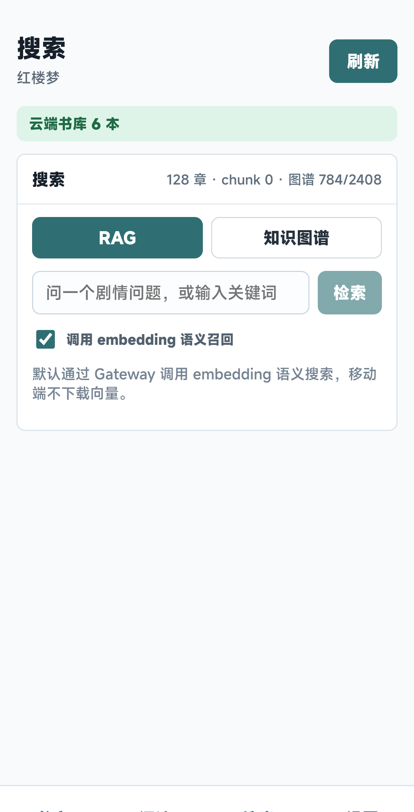
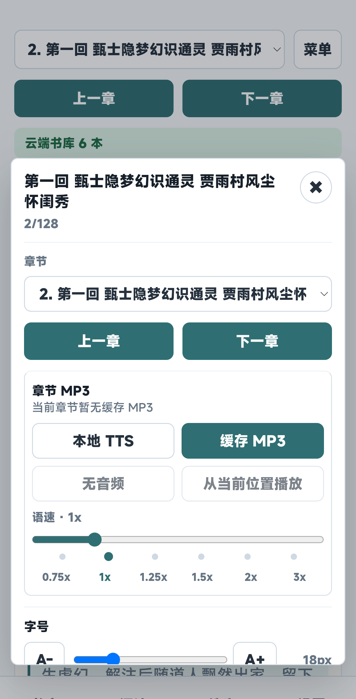
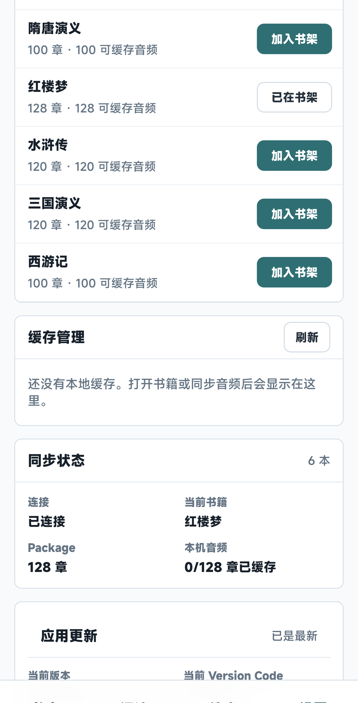
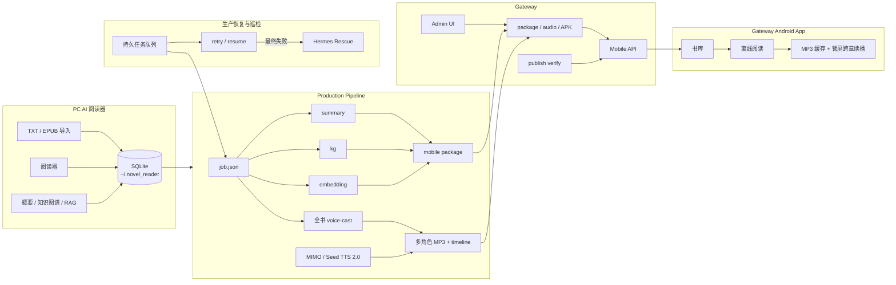

# 小说阅读助手

[English](README.en.md) | [中文](README.md)

AI 原生的小说阅读器：把长篇小说变成可检索、可追踪、可听的智能阅读体验。它不仅能导入和阅读本地书库，还会为整本书生成知识图谱、RAG 检索索引和多角色有声小说音频，让读者可以一边读正文，一边查人物关系、追剧情伏笔、听接近“原声剧”的分角色朗读。

PC 端负责导入、阅读、AI 概要、知识图谱和 RAG 检索；`production-pipeline/` 负责批量生成概要、图谱、embedding、多角色 MP3 和移动数据包，并提供可恢复的生产队列与故障救援；`gateway/` 负责云端分发、鉴权、运维后台和移动 API；`gateway-android-app/` 提供离线阅读、MP3 缓存、锁屏连续播放和应用更新。


> 截图中的桌面 demo 使用公开文本《三国志演义》《西游记》；移动端截图只展示缓存管理和公开经典书名，避免展示私人阅读记录或少儿不宜内容。

## 核心卖点

| 卖点 | 体验 |
|------|------|
| AI 原生阅读 | 阅读器不只是展示正文，而是围绕章节、人物、关系、证据和音频生产组织整本书 |
| 知识图谱 | 自动抽取人物、地点、门派、道具、功法、事件和关系，支持证据跳转、复审、合并和导出 |
| RAG 剧情问答 | 基于概要、正文 chunk 和图谱实体召回，回答跨章节问题并保留来源依据 |
| 多角色有声小说合成 | 支持 MIMO 与火山引擎 Seed TTS 2.0，生成固定选角、章节 MP3、角色/旁白时间线和播放高亮 |
| 移动端连续阅读 | Gateway Android App 同步书库、数据包和音频，支持离线读听和锁屏跨章续播 |

## 项目快照

| 模块 | 当前能力 | 入口 |
|------|----------|------|
| PC AI 阅读器 | TXT/EPUB/文本型 PDF 导入、阅读进度、概要、知识图谱、RAG、数据库备份恢复 | `npm run dev` |
| Production Pipeline | 全流程生产、多 Provider TTS、全书固定选角、持久队列、自动续跑和失败任务救援 | `npm run production-pipeline -- run --job ...` |
| Gateway 服务 | 移动书库、package/audio 分发、RAG/AI 转发、设备授权、管理后台、指标与事件 | `npm run gateway:dev` |
| Gateway Android App | Gateway 登录、书库同步、离线 package、章节 MP3 缓存、锁屏跨章续播、应用更新 | `npm run gateway-android:android:build` |
| 测试与运维 | 单元、接口、E2E、Android 构建、Gateway smoke、发布检查和 Runbook | `npm run test:smoke` |

## 近期改进

- **双 TTS Provider**：多角色音频流水线现支持小米 `mimo-v2.5-tts` 与火山引擎 `seed-tts-2.0`，Provider、凭据、专用旁白和音色目录可独立配置。
- **全书角色固定选角**：知识图谱完成后，按全书角色提及次数选出主要角色并生成 `voice-cast.json`；后续章节复用同一声线，次要角色再按年龄、性别、身份和性格匹配。
- **中文小说音色约束**：音色资料保留 Provider 的完整清单，但中文小说生产只向导演模型和 TTS 白名单开放中文音色，减少跨语言误选。
- **可恢复生产服务**：持久队列支持并发上限、服务重启后续跑、指数退避、手动 retry/stop，并保留 `run.json`、item 状态、日志和 checkpoint。
- **分层故障救援**：普通故障先由服务自动 `resume`；最终失败后可由 Hermes Rescue 在隔离 checkout 中生成脱敏现场、验证有限范围补丁，并按静态策略决定是否部署和重试。
- **锁屏连续听书**：Android WebView 允许章节加载回调在锁屏状态下启动下一章 MP3，解决当前章结束后必须手动继续的问题。

### 《红楼梦》生产 DAG 预览



> 使用公开经典《红楼梦》的 128 章生产模板展示正式生产控制台。DAG 覆盖章节摘要、知识图谱、向量索引、有声书、打包、发布和验证，并在启动前集中检查并发、预计费用和外部写入风险。

## 真实界面

### PC 书库与阅读

| 书库 | 阅读器 |
|------|--------|
|  |  |

### RAG 搜索


### Gateway Android 真机

| 书库覆盖率 | 阅读摘要 | RAG / 图谱搜索 |
|------------|----------|----------------|
|  |  |  |

| 多角色音频 / TTS | 同步与缓存 |
|------------------|------------|
|  |  |

## 系统架构



## 核心能力

- **AI 原生阅读**：导入 `.txt` / `.epub` / 带文本层的 `.pdf` 后，系统围绕章节生成概要、实体、关系、embedding 和音频，读书过程天然带剧情索引。
- **知识图谱理解长篇小说**：自动抽取人物、门派、道具、功法、地点、事件和关系，保留证据章节，支持编辑、合并、拆分、复审和 GraphML/JSON 导出。
- **RAG 跨章节问答**：融合章节概要、正文 chunk 和图谱实体召回，适合追踪人物首次出现、道具流转、伏笔回收和剧情前因后果。
- **多角色有声小说合成**：支持 MIMO 与 Seed TTS 2.0；导演脚本结合知识图谱、音色目录和全书固定选角生成分角色/旁白 MP3 与 timeline manifest。
- **移动端离线读听一体**：Gateway Android App 通过 Gateway 获取完整数据包和章节 MP3，缓存后可离线阅读、搜索、播放，并在锁屏状态下自动衔接下一章。
- **正式生产与发布闭环**：从导入、概要、图谱、embedding、音频、package 到 Gateway 发布和 HTTP 验证，支持持久队列、自动续跑、日志、checkpoint、远端校验和分层故障救援。
- **本地优先与可控部署**：书库数据默认保存在本地 SQLite；Gateway 负责公网鉴权、设备角色、可见范围、指标、事件和 APK 更新。

## 快速开始

### 1. 启动 PC 阅读器

```bash
npm install
npm run dev
```

默认地址：

| 服务 | 地址 |
|------|------|
| 前端 | `http://127.0.0.1:5173/` |
| 本地 SQLite API | `http://127.0.0.1:5174/` |

打开前端后可以导入 `.txt`、`.epub` 或带文本层的 `.pdf`，进入阅读器，再按需配置模型、生成概要、构建知识图谱或使用 RAG 搜索。扫描型 PDF 需先通过 OCR 生成可复制的文本层。

### 2. 启动 Gateway

```bash
npm --prefix gateway install
npm run gateway:dev
```

默认监听 `127.0.0.1:6180`。Gateway 负责移动端 API、管理后台、AI/embedding 转发、package/audio/APK 分发和运行指标。更多部署说明见 [gateway/README.md](gateway/README.md) 与 [gateway/docs/deployment.md](gateway/docs/deployment.md)。

### 3. 构建 Android App

```bash
npm --prefix gateway-android-app install
npm run gateway-android:android:build
```

Debug APK 输出到：

```text
gateway-android-app/android/app/build/outputs/apk/debug/
```

发布到 Gateway 下载目录：

```bash
npm run gateway:publish-android-apk
```

发布后固定下载路径为 `/downloads/novel_gateway.apk`，并写入 `/downloads/android-app.json` 供 App 内更新检查使用。

### 4. 跑生产流水线

```bash
npm run production-pipeline -- doctor --job production-pipeline/config/example.job.json
npm run production-pipeline -- run --job production-pipeline/config/example.job.json
npm run production-pipeline -- status --run <runId|runDir|run.json>
```

`doctor` 会先检查源文件、模型配置、TTS 配置和 Gateway 凭据；`run` 执行配置中的阶段；`resume` 可从已有 `run.json` 续跑。发布完成后必须使用 `verify` 检查真实 Gateway HTTP 结果，而不只相信本地日志。

多角色 TTS 可按任务选择 MIMO 或火山引擎 Provider。建议从示例复制私有配置，并把实际 API Key 只放在环境变量或部署环境文件中：

```bash
cp production-pipeline/config/tts-director.example.json ~/.novel_reader/tts-director.config.json
# MIMO_API_KEY=... 或 VOLCENGINE_TTS_API_KEY=...
```

需要持久排队、并发控制和服务重启后自动恢复时，可启动生产服务；默认控制台地址为 `http://127.0.0.1:6290`：

```bash
npm run production-pipeline:service
```

普通失败由服务自身的 retry/resume 处理。最终失败任务可选配 Hermes Rescue；它默认只生成脱敏 incident 并验证补丁，不会自动部署或重试。安全模型和 systemd 部署方式见 [Hermes Agent 生产故障救援](production-pipeline/docs/hermes-rescue.md)。

典型全量生产链路：

```text
导入原文 -> 章节概要 -> 知识图谱 -> RAG embedding -> 多角色音频 -> 移动数据包 -> Gateway 发布 -> 远端验证
```

## 功能地图

### PC AI 阅读器

- TXT 自动识别 UTF-8 / GB18030，EPUB 按 OPF spine 导入 XHTML 章节。
- 章节列表按 100 章分页，支持章节跳转、键盘翻章、字体设置、阅读进度恢复。
- 首页可备份/恢复完整 SQLite 数据库，包含书籍、章节、概要、图谱、embedding 和设置。
- 模型配置保存在本地，可为生成模型和 embedding 模型分别选择 provider、base URL、model 和并发策略。

### AI 概要、图谱与 RAG

- 概要支持单章、当前页和全书缺失章节批量生成，失败章节不会中断整批任务。
- 知识图谱抽取人物、门派、道具、功法、地点、灵兽、事件和关系，并保留章节证据。
- 图谱支持扫描当前章、范围扫描、全书扫描、断点恢复、跳过已完成、覆盖重扫和 saved JSON 重放。
- RAG 搜索基于章节概要 embedding、正文 chunk embedding 和图谱实体召回，答案可带来源章节。

### Gateway 与 Admin UI

- 移动端接口：`/auth/session`、`/mobile/books`、`/mobile/books/:bookId/package`、`/mobile/books/:bookId/audio`、音频下载和 manifest。
- 管理端接口：书籍、数据包、音频、设备、请求日志、事件、指标、APK 发布元数据。
- 鉴权区分 `GATEWAY_ADMIN_ACCESS_TOKEN` 和 `GATEWAY_MOBILE_ACCESS_TOKEN`；生产环境不回退 dev token。
- 支持书籍可见范围、设备角色、公开 APK 下载和安全 smoke 检查。

### Gateway Android App

- 保存 Gateway 地址、token、设备名和稳定设备 ID。
- 拉取云端书库，下载并缓存单书完整 package。
- 阅读进度、阅读主题、package 缓存、MP3 缓存按书隔离。
- 支持章节 MP3 下载、manifest timeline 播放高亮、系统 TTS 和 AI 多角色 MP3 两种听书路径。
- MP3 播放在锁屏状态下也能自动加载并播放下一章，无需解锁后手动继续。
- 支持检查 Gateway 发布的最新版 APK，并交由 Android 系统确认安装。

### Production Pipeline

- CLI-first，不依赖 PC 前端开发服务器即可读写 SQLite 和生产产物。
- 全流程支持 `import`、`summary`、`kg`、`embedding`、`audio`、`package`、`publish`、`verify`。
- `audio` 阶段可选择 MIMO 或 Seed TTS 2.0，并调用 TTS director 生成全书主要角色固定选角、章节导演脚本、MP3 和时间线 manifest。
- 中文小说只使用各 Provider 音色目录中的中文声线；固定选角写入书籍输出目录的 `voice-cast.json` 并跨章节复用。
- 运行状态保存在 `tmp/production-pipeline/runs/<bookId>/<runId>/`，包含 `run.json`、`items.sqlite`、日志、产物和 checkpoint。
- 持久生产服务支持任务队列、并发上限、重启恢复、retry/stop；Hermes Rescue 可在最终失败后按最小权限策略辅助诊断和恢复。
- `publish` 使用文件同步发布大体积 package/audio；`verify` 使用真实 Gateway HTTP API 检查书库、章节、图谱、embedding 覆盖和音频下载。

## 常用命令

| 命令 | 用途 |
|------|------|
| `npm run dev` | 同时启动 Vite 前端和本地 SQLite API |
| `npm run build` | TypeScript 检查并构建 PC 前端 |
| `npm run test:unit` | 运行 Vitest 单元测试 |
| `npm run test:e2e` | 运行 Playwright E2E |
| `npm run test:smoke` | 单元 + E2E smoke |
| `npm run gateway:dev` | 启动 Gateway |
| `npm run gateway:test` | 运行 Gateway 测试 |
| `npm run gateway:admin-ui:build` | 构建 Gateway 管理后台 |
| `npm run gateway:publish-package` | 发布移动端 package |
| `npm run gateway:publish-audio` | 发布章节 MP3 与 audio catalog |
| `npm run gateway:publish-android-apk` | 发布 Android APK |
| `npm run gateway-android:android:build` | 构建 Gateway Android debug APK |
| `npm run production-pipeline -- doctor --job <job>` | 生产任务预检查 |
| `npm run production-pipeline -- run --job <job>` | 执行生产任务 |
| `npm run production-pipeline -- resume --run <run>` | 续跑生产任务 |
| `npm run production-pipeline:service` | 启动持久生产队列与控制台 |
| `npm run production-pipeline:test` | 运行生产流水线测试 |
| `npm run production-pipeline:hermes-rescue -- --policy <policy> --once` | 单次检查最终失败任务并生成救援 incident |

## 数据与配置

| 项 | 默认位置 / 变量 |
|----|-----------------|
| 本地数据目录 | `NOVEL_READER_DATA_DIR`，默认 `~/.novel_reader` |
| 本地 SQLite | `NOVEL_READER_DB_PATH`，默认 `~/.novel_reader/novel_reader.sqlite` |
| 前端端口 | `NOVEL_READER_PORT`，默认 `5173` |
| API 端口 | `NOVEL_READER_API_PORT`，默认 `5174` |
| Gateway 数据目录 | `GATEWAY_DATA_DIR` |
| Gateway 音频目录 | `GATEWAY_AUDIO_DIR` |
| Gateway 下载目录 | `GATEWAY_DOWNLOADS_DIR` |
| MIMO TTS 凭据 | `MIMO_API_KEY` |
| 火山引擎 TTS 凭据 | `VOLCENGINE_TTS_API_KEY` |
| Hermes Rescue 策略 | `HERMES_RESCUE_POLICY`，默认使用部署环境指定的私有策略文件 |
| 离线扫描器数据库 | `NOVEL_READER_OFFLINE_DB`，默认 `~/.novel_reader/offline.sqlite` |

## 项目结构

```text
novel_reader/
├── src/                    # PC React 前端
├── scripts/                # 本地 SQLite API、开发启动器、离线扫描器
├── gateway/                # Fastify Gateway 服务与 Admin UI
├── gateway-android-app/    # Capacitor + React Android App
├── production-pipeline/    # 正式内容生产流水线
├── tests/                  # API、单元、E2E 测试
├── docs/                   # 产品、测试、运维、截图和路线图文档
└── README.md               # 项目主页
```

## 文档入口

- [产品功能说明书](docs/product-spec.md)
- [开发文档](docs/development.zh-CN.md)
- [Backend API Reference](docs/backend-api.md)
- [正规化测试与运维规划](docs/quality-ops-roadmap.md)
- [测试用例矩阵](docs/test-case-matrix.md)
- [系统性 Code Review Checklist](docs/code-review-checklist.md)
- [运维 Runbook](docs/operations-runbook.md)
- [发布检查清单](docs/release-checklist.md)
- [Gateway 说明](gateway/README.md)
- [Gateway Android App 说明](gateway-android-app/README.md)
- [Production Pipeline 说明](production-pipeline/README.md)
- [内容生产常驻服务部署与 Codex 外层巡检](production-pipeline/docs/service-deployment.md)
- [多角色 TTS 与固定选角](production-pipeline/docs/tts/README.md)
- [Hermes Agent 生产故障救援](production-pipeline/docs/hermes-rescue.md)
- [知识图谱路线图](docs/knowledge-graph-roadmap.md)

## 安全提示

- 这是本地优先项目，PC 端 API Key 默认保存在本地 SQLite 中；不要把本地 API 当作公开多用户服务裸露部署。
- Gateway 生产环境必须显式配置 admin/mobile token，不应使用开发 fallback token。
- 移动端不保存上游 LLM、embedding、TTS 或对象存储密钥；相关调用应由 Gateway 转发和限流。
- Hermes Rescue 默认不继承生产 Token/API Key，不直接修改在线目录，也不执行 Agent 动态生成的部署命令；自动部署和自动重试必须显式启用。
- 内容生产产物、MP3、package 和大型运行日志通常不应提交到 Git，发布后用 Gateway HTTP 和文件目录共同验证。
