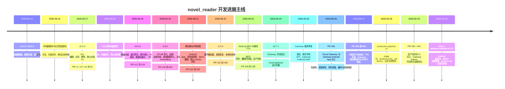
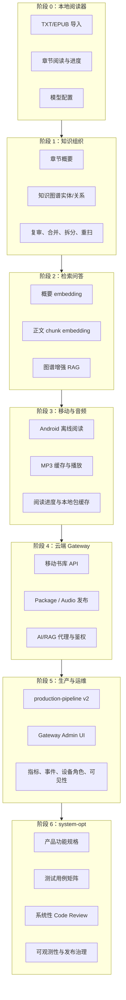

# GitHub 开发历史可视化

更新时间：2026-06-30

本文档根据本仓库 Git 历史、tag 和 GitHub PR 记录整理，用于快速理解小说阅读助手从本地阅读器到 Gateway、Android、生产流水线和运维后台的演进过程。

## 1. 阶段总览

## 2. 主线 PR 演进图

```mermaid
flowchart LR
    A["阅读器基础\nv0.1.0-v0.2.0\n2026-06-14"] --> B["知识图谱基础\n本地 SQLite / 实体关系 / 扫描任务\n2026-06-15"]
    B --> C["KG 清洗闭环\nPR #1-#9\n合并/编辑/复审/续扫/批量概要\n2026-06-17~18"]
    C --> D["RAG 与图谱增强\nPR #12-#18\n重扫预览 / 图可视化 / 证据搜索 / RAG / 备份\n2026-06-19"]
    D --> E["阅读体验与 EPUB\nPR #19-#25\n0.6.0 / EPUB / 共指 / 长章节 embedding\n2026-06-20~21"]
    E --> F["第一代 Android 与项目工程化\nPR #26-#33\n移动端 / demo / 开源流程 / 懒加载与进度\n2026-06-21~23"]
    F --> G["MP3 与离线 TTS\nPR #34-#38\nMP3 同步播放 / 时间轴 / 生产文档\n2026-06-23~24"]
    G --> H["Cloud Gateway\nPR #39\nGateway API / Gateway Android App / 发布与缓存\n2026-06-25~26"]
    H --> I["内容生产流水线\nPR #40-#43\nproduction-pipeline v2 / TTS 并发 / publish / verify\n2026-06-27~29"]
    I --> J["Gateway Admin 与可见性\nPR #44\n设备角色 / 书籍可见性 / Admin UI / 指标事件\n2026-06-29~30"]
    J --> K["system-opt\n测试、Code Review、可观测性和发布治理\n2026-06-30 起"]

    classDef foundation fill:#eef6ff,stroke:#337ab7,color:#123;
    classDef intelligence fill:#f4f0ff,stroke:#7b61ff,color:#20124d;
    classDef mobile fill:#ecfff4,stroke:#2e8b57,color:#102b1a;
    classDef ops fill:#fff7e6,stroke:#c47f00,color:#3b2500;
    class A,B foundation;
    class C,D,E intelligence;
    class F,G,H mobile;
    class I,J,K ops;
```

## 3. 能力版图演进

## 4. 版本与里程碑

| 日期 | 版本/PR | 里程碑 |
|------|---------|--------|
| 2026-06-14 | `v0.1.0`, `v0.2.0` | 阅读器基础、章节导航和模型并发设置 |
| 2026-06-17 | `v0.3.0`, PR #1/#2 | 知识图谱编辑能力和默认并发优化 |
| 2026-06-19 | `v0.5.0`, PR #12-#18 | KG 纠错、图可视化、RAG、备份恢复 |
| 2026-06-20 | `0.6.0`, PR #19-#25 | EPUB、阅读 UX、共指、离线导入、长章节 embedding |
| 2026-06-22 | `0.7.0`, PR #26-#33 | Android 移动端、demo、开源流程、懒加载和进度恢复 |
| 2026-06-24 | `v0.7.1`, PR #34-#38 | Android MP3、TTS 时间轴和生产文档 |
| 2026-06-26 | PR #39 | Cloud Gateway 与 Gateway Android App 合入 |
| 2026-06-27 | PR #40-#42 | 内容生产流水线、TTS 并发、Gateway 移动阅读修复 |
| 2026-06-29 | PR #43/#44 | production-pipeline v2、Gateway Admin、设备角色和可见性 |
| 2026-06-30 | `0.8.0`, `gateway-android-v0.2.0` | Gateway Android 发布流与系统正规化阶段入口 |

## 5. 当前判断

开发节奏已经从“功能快速扩张”进入“系统正规化”。历史上主要风险点也很清楚：

- 知识图谱与 RAG 已经具备强数据修改能力，下一步需要测试矩阵、审计和回滚。
- Gateway 与 Android App 已经承担真实移动使用路径，下一步需要更完整的鉴权、设备角色、缓存和发布回归。
- production-pipeline 已经具备整书生产与发布链路，下一步需要指标、失败诊断、verify 可信度和运维 runbook。
- Admin UI 已经从 demo 管理台变成运维入口，下一步需要空状态、失败态、真实数据边界和监控指标持续固化。
